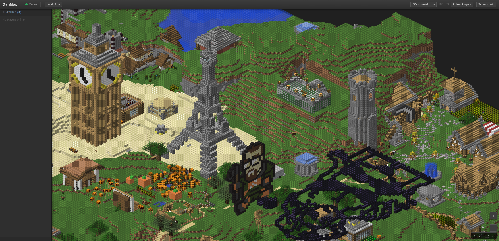

# DynMap

DynMap plugin for NostalgiaCore

## Screenshots

<table>
  <tr>
    <td align="center">
      
    </td>
    <td align="center">
      
    </td>
  </tr>
</table>

## Features

- 2D / 3D view
- multiworld support
- feature for following players
- make current view / 3d isometric screenshot
